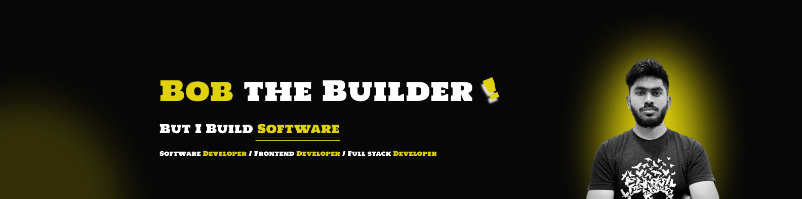

<!--Banner-->

<!--Header Name-->

#  ʜɪ, ɪ'ᴍ **Rɪsʜᴀʙʜ!**

🎯 _Dɪɢɪᴛᴀʟ Cʀᴀғᴛsᴍᴀɴ | Sᴏғᴛᴡᴀʀᴇ Dᴇᴠᴇʟᴏᴘᴇʀ_

---

## 🌟 **ᴀʙᴏᴜᴛ ᴍᴇ**

I’m a **Full Stack Developer** and **Tech Enthusiast** passionate about crafting modern, scalable web applications. With hands-on experience in **JavaScript, Python, TypeScript, PHP**, and frameworks like **React, Next.js, Laravel**, and **Django REST Framework**, I strive to turn complex problems into elegant solutions.

- 👨‍💻 **Currently working as a Software Developer at [Bitwise Builder](https://bitwisebuilder.com).**
- ✍ **Check out my blogs on [Medium](https://medium.com/@iamrishabhnirmalkar).**
- 🌱 **Learning new technologies every day: Backend Development & DevOps.**
- 💻 **Visit my [Portfolio](/)** for detailed work.
- 💬 **Let’s connect for collaborations or projects.**

<!-- ---

  

 -->

---

## 🚀 **ᴛᴇᴄʜ sᴛᴀᴄᴋ**

  

### **Languages & Tools**

  
  
  
  
  
  

  
  

  

---

## 📝 **ʟᴀᴛᴇsᴛ ʙʟᴏɢ ᴘᴏsᴛs**

- [⚛️ Next.js Frontend — Template Setup 🎨](https://medium.com/@iamrishabhnirmalkar/next-js-frontend-template-setup-915602b39d1c)
- [🚀 Production Project Setup For Node.js 🛠️](https://medium.com/@iamrishabhnirmalkar/production-project-setup-for-node-997fd5cdedcf)

---

## 🏆 **Gɪᴛʜᴜʙ Aᴄʜɪᴇᴠᴇᴍᴇɴᴛs**

  

---

## 📊 **Gɪᴛʜᴜʙ Sᴛᴀᴛs**

<table align="center">
  <tr>
    <td align="center">
      <strong>Gɪᴛʜᴜʙ Sᴛᴀᴛs</strong> 
      
    </td>
    <td align="center">
      <strong>Sᴛʀᴇᴀᴋ Sᴛᴀᴛs</strong> 
      
    </td>
  </tr>
</table>

---

## 📈 **Cᴏɴᴛʀɪʙᴜᴛɪᴏɴ Gʀᴀᴘʜ**

  

---

## 🌟 **Tʜᴏᴜɢʜᴛ ᴏғ ᴛʜᴇ Dᴀʏ**

  

---

## 🤝 **Cᴏɴɴᴇᴄᴛ Wɪᴛʜ Mᴇ**

  
  
  
  
  
  

---

## ☕ **Sᴜᴘᴘᴏʀᴛ Mᴇ**

  

---

  

